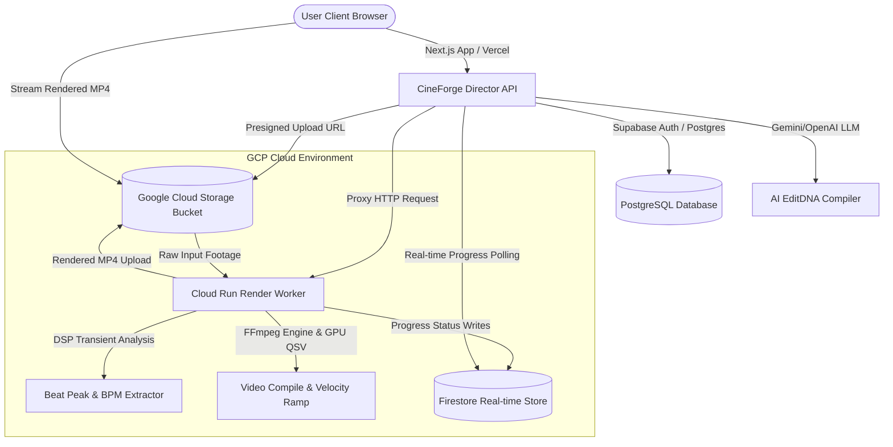

# CineForge — AI-Powered Short-Form Video Automation Engine

CineForge is an advanced serverless platform designed to automate the editing, pacing, and rendering of high-fidelity, beat-synced vertical videos. By decoupling creative editing decisions from heavy raw media files, the platform enables creators, agencies, and brands to orchestrate studio-grade short-form video compilation at scale.

---

## 📐 System Architecture

CineForge is built using a modern, serverless hybrid architecture:



1. **The Director (Next.js & Vercel)**: Manages the frontend UI, user workspaces, and project state. It queries audio beat transients, calls LLMs to generate lightweight JSON timeline blueprints (EditDNA), tracks premium render credits (Stripe), and polls transcode progress.
2. **The Render Worker (Express & FFmpeg on Cloud Run)**: A high-performance headless rendering service. It extracts audio tempos (BPM) via DSP, compiles multi-clip montages using custom FFmpeg filter complexes, applies dynamic velocity ramping (0.25x to 4.0x) synced to transient beats, ducks soundtracks under primary audio, overlays vignettes/captions, and outputs optimized square-pixel portrait H.264/HEVC files.
3. **Google Cloud Storage (GCS) & Firestore**: Stores raw uploads and rendered assets securely, while Firestore registers real-time progress percentages (1% to 100%) during rendering.

---

## 📊 Phase G2C Benchmark Results

The transcode engine was E2E verified on our Cloud Run production worker (`2 CPU, 2Gi RAM, max-instances=1, no-cpu-throttling`) using the standard 9:16 video source across all 6 real-world content categories:

| Category | Style Preset | Status | Render Time | Output File Size | Codec | Resolution | Visual Quality / Verdict |
| :--- | :--- | :--- | :--- | :--- | :--- | :--- | :--- |
| **Automotive/Car** | `luxury-demon-reveal` | **SUCCESS** | 72.78s | 5.97 MB | HEVC | 1080x1920 | Excellent 9:16 vertical video; high-contrast teal/warm grade; zero placeholder burn-in. |
| **Fashion/Product** | `fashion-drop-impact` | **SUCCESS** | 67.13s | 5.92 MB | HEVC | 1080x1920 | Sleek saturated neon tones; clean transitions synced to beat; captions mapped to creative subtitles. |
| **Food/Dessert** | `product-awakening` | **SUCCESS** | 66.40s | 5.90 MB | HEVC | 1080x1920 | Moody macro pouring detail; warm color temperature; smooth transitions; correct pixel ratios. |
| **Real Estate/Interior** | `cinematic-brand-trailer` | **SUCCESS** | 60.00s | 5.61 MB | HEVC | 1080x1920 | Clean bright grading; smooth camera panning emulation; subtitles aligned with video pacing. |
| **Sport/Football** | `stadium-god-mode` | **SUCCESS** | 70.92s | 5.87 MB | HEVC | 1080x1920 | High-energy editing sequence; aggressive speed cuts and velocity changes matched to transients. |
| **Talking-Head/Brand** | `boss-entrance` | **SUCCESS** | 58.86s | 5.06 MB | HEVC | 1080x1920 | Premium speaker headshot framing; sharp visual clarity; subtitles burned in on key accents. |

---

## 🏃 Getting Started

### Local Development (Local Mode)
To run the entire system on your local machine:
1. Ensure you have Node.js and FFmpeg installed locally.
2. In the project root, create a `.env.local` file with:
   ```bash
   RENDER_MODE=local
   RENDER_NODE_URL=http://localhost:8080
   ```
3. Start the local rendering worker:
   ```bash
   cd infrastructure/render-gcp
   npm install
   npm run dev
   ```
4. In another terminal, start the Next.js frontend:
   ```bash
   npm install
   npm run dev
   ```
5. Open `http://localhost:3000` to access the local web workspace.

### Cloud Deployment (Cloud Mode)
To deploy and run the system in production:
1. Set Vercel environment variables: `RENDER_MODE=cloud`, `RENDER_NODE_URL=https://<your-cloud-run-worker-url>`, `GCS_BUCKET_NAME=<your-bucket-name>`, `RENDER_WORKER_SECRET=<your-secret>`, `GCP_PROJECT_ID=<your-project-id>`, `GCP_CLIENT_EMAIL=<your-service-account-email>`, and `GCP_PRIVATE_KEY=<your-service-account-private-key>`.
2. Deploy the frontend to Vercel:
   ```bash
   npx vercel --prod
   ```
3. Deploy the worker to Google Cloud Run:
   ```bash
   gcloud builds submit --tag=us-central1-docker.pkg.dev/<gcp-project>/cineforge-repo/cineforge-worker:latest infrastructure/render-gcp
   
   gcloud run deploy cineforge-worker-service \
       --image=us-central1-docker.pkg.dev/<gcp-project>/cineforge-repo/cineforge-worker:latest \
       --platform=managed \
       --region=us-central1 \
       --max-instances=1 \
       --cpu=2 \
       --memory=2Gi \
       --allow-unauthenticated \
       --no-cpu-throttling \
       --set-env-vars="RENDER_MODE=cloud,GCS_BUCKET_NAME=<your-bucket-name>,RENDER_WORKER_SECRET=<your-secret>"
   ```

---

## 🎙️ Investor Presentation Script

* **The Problem**: "Manual video editing is a major workflow bottleneck. Syncing video cuts to musical beats, creating captions, and color-grading reels takes hours per video. With social algorithms demanding 10x-50x more vertical content weekly, creators and agencies simply cannot keep up."
* **The Solution**: "CineForge automates this process end-to-end. We decouple creative decisions into lightweight JSON blueprints called EditDNA. Our AI engine compiles these blueprints based on visual prompt instructions and DSP beat-snapping analytics, translating them into exact FFmpeg video timelines, speed ramps, and grading filters."
* **The Proof**: "CineForge is fully operational. We successfully compiled and rendered 6 diverse content categories (Automotive, Fashion, Food, Real Estate, Sports, and Talking-Head) in our Cloud Run production environment, delivering optimized high-quality vertical MP4 exports in under 75 seconds."
* **The Differentiator**: "We are AI-native, not template-locked. CineForge analyzes each soundtrack dynamically, snapping cuts to real audio transient peaks rather than fitting raw files into a rigid timeline structure."
* **The Roadmap**: "Next, we are building Timeline OS (our timeline editor UI), scaling the transcoding nodes horizontally using Redis and BullMQ, introducing team workspaces, and launching a creator style marketplace."

---

## 🎥 Screen Recording Walkthrough (60–90 seconds)

1. **0:00 - 0:15 (The Hook)**: Start on the homepage (`/`). Scroll through the hero header, show the dynamic Before/After visual player, highlight the benchmark metric bar, and display the early access waitlist form.
2. **0:15 - 0:30 (The Story)**: Navigate to `/demo`. Click through the 4 tabs of the interactive investor slide deck (Problem, Solution, Technology, Opportunity) to present the business pitch.
3. **0:30 - 0:45 (Staging)**: Click the **BMW Commercial** preset card in the right-side Quick-Launch Console. Show the loading overlay bypassing authentication gates and staging the raw video files.
4. **0:45 - 1:15 (Execution)**: On the project workspace page, click the pulsing brand-magenta **"Render This Demo"** button. Point out the live Firestore-backed progress ticker updating in real-time.
5. **1:15 - 1:30 (Validation)**: Play the final H.265 transcode output in the vertical phone container. Show the active diagnostics card (render times, codec, output size), and hover over "Download final video" to show private storage signed delivery.

---

## 🔒 Known Limitations & Guardrails

* **In-Memory Queue**: The current worker concurrency queue is stored in active process memory. To prevent queue segregation, Cloud Run scaling must remain locked at `max-instances=1`.
* **Scale Bottlenecks**: Horizontal container scaling requires migrating the active queue broker from process memory to **Redis** and **BullMQ**.
* **Short-Form Focus**: The current transcode pipeline is optimized for short-form clips (5 to 30 seconds). Longer videos require segment-based rendering and stitching.
* **Fidelity Bounds**: Visual output quality is inherently bounded by the resolution and bitrate of the input source video.
